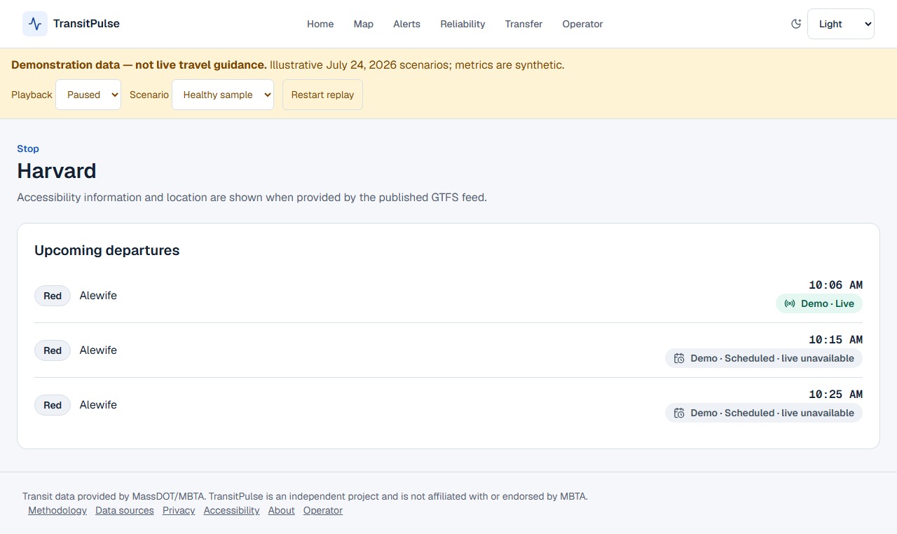
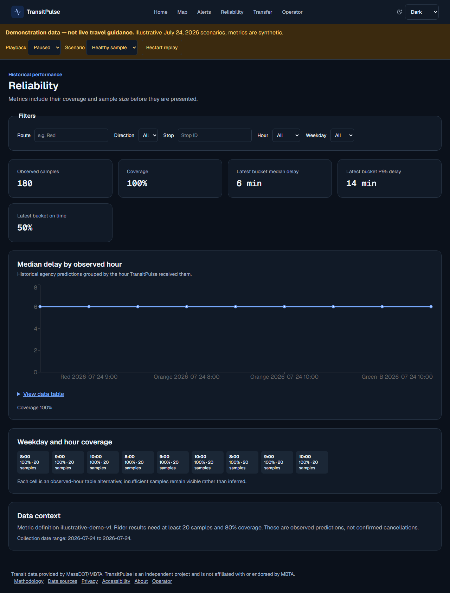

# TransitPulse

TransitPulse helps Boston MBTA riders understand arrivals, service alerts, historical reliability, and transfer uncertainty. Public operator views explain feed health and data quality.

## Try the demonstration

Use Node.js 22 and pnpm 11:

```sh
pnpm install --frozen-lockfile
pnpm --filter web dev
```

Open `http://localhost:3000`. Without a configured backend origin, the app runs an explicitly labeled demonstration. Search Harvard, inspect its arrival board, switch to a feed outage, explore reliability, and calculate a transfer. Playback supports pause, speed, and restart. [Demo walkthrough](docs/demo.md).

**Demo data is illustrative, not live travel guidance.** Reliability examples are synthetic. The live backend and recorded-fixture replay are separate execution modes; a live outage never silently switches to synthetic data.





## Features

- Route/stop search, arrival boards, service alerts, vehicle map and text alternatives.
- Explicit scheduled, predicted, stale, unknown, and fallback states.
- Historical route/hour reliability with sample and coverage context.
- Empirical transfer-risk calculation with walking assumptions and insufficient-data handling.
- Public feed-health and system diagnostics.
- Responsive light/dark themes, keyboard navigation, and an offline-safe PWA shell.

## Live local setup

Python 3.12, uv, and Docker are also required.

1. Follow [infrastructure setup](infra/README.md) to start PostgreSQL/PostGIS and Valkey using ignored local environment files.
2. In `services/backend`, run `uv sync --frozen`, configure the backend environment, and run `uv run transitpulse-migrate`.
3. Import the current schedule with `uv run transitpulse-import-gtfs`.
4. Start `uv run transitpulse-api` and `uv run transitpulse-worker` in separate terminals. Schedule `uv run transitpulse-aggregate-reliability` using the supplied cron example.
5. Configure `NEXT_PUBLIC_DATA_MODE=live` and `NEXT_PUBLIC_API_BASE_URL=http://localhost:8000` for the frontend, then restart it.

The backend exposes `/health/live`, `/health/ready`, `/docs`, and `/openapi.json`. Real reliability needs retained observations; short collection windows correctly show insufficient evidence.

## Engineering

| Topic                              | Documentation                          |
| ---------------------------------- | -------------------------------------- |
| Architecture and data authority    | [Architecture](docs/architecture.md)   |
| Engineering decisions and evidence | [Case study](docs/case-study.md)       |
| API contracts                      | [API reference](docs/api.md)           |
| Ingestion, TTL, reconciliation     | [Realtime data](docs/realtime-data.md) |
| Transfer baseline and limitations  | [Transfer risk](docs/transfer-risk.md) |
| Deployment and environments        | [Deployment](docs/deployment.md)       |
| Logs, metrics, backups, recovery   | [Operations](docs/operations.md)       |
| Security boundaries and roles      | [Security](docs/security.md)           |
| Tests and long-duration validation | [Testing](docs/testing.md)             |
| Performance budgets                | [Performance](docs/performance.md)     |

Stack: Next.js/React/TypeScript, Tailwind, MapLibre, Recharts, FastAPI/Python, SQLAlchemy/Alembic, PostgreSQL/PostGIS, and Valkey. One backend package supports independent HTTP, worker, and aggregation processes; SSE distributes current-state changes.

## Limits and cost

The project is local-first and free-tier-first. The frontend demonstration can run on Vercel without an always-on backend. Live ingestion needs an available host; do not infer live uptime from a frontend deployment. No paid services or automatic spending are required by this repository.

Detailed history is limited to selected routes and bounded retention. Predictions are not verified arrivals or cancellations. Transfer probabilities assume independent historical delays and do not guarantee connections. Long-duration uptime, storage-growth measurements, and long-term calibration remain deployment validation work; synthetic demo metrics are not evidence of those results.

## Attribution and license

Transit data provided by MassDOT/MBTA. TransitPulse is an independent project and is not affiliated with or endorsed by MBTA. Maps use OpenFreeMap and OpenStreetMap contributors with visible attribution.

[MIT License](LICENSE).
