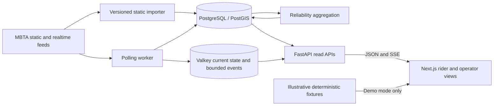

# Architecture

TransitPulse is a Boston MBTA rider interface and a public, read-only feed diagnostics application. The frontend can run an explicitly labeled demonstration without a database. Live installations use a Python modular monolith with independent API, polling, and aggregation processes.

## Data authority

- Static GTFS imports validate archive paths, sizes, coordinates, identifiers, calendars, and times beyond midnight. A transaction activates a complete version atomically. Original agency identifiers remain strings.
- PostgreSQL owns schedule versions, poll outcomes, retained observations, and reproducible aggregates. PostGIS supports geographic records; native monthly partitions bound detailed vehicle history.
- Valkey owns replaceable current-state projections with TTLs and a bounded replay window for SSE. It is not the historical source of truth.
- Raw snapshots retain checksums and parser/source provenance. Default raw retention is six hours; selected detailed route history is fourteen days. Compact aggregate retention is twenty-four months.
- Browser views distinguish scheduled, agency-predicted, stale, unknown, and estimated values. Missing predictions fall back to the published schedule; an outage does not establish a cancellation.

## Design decisions

SSE matches one-way update delivery and reconnects with bounded event replay. Clients fall back to polling. There is no need for a bidirectional WebSocket protocol in the current rider experience.

One Python package keeps parsing, reconciliation, and calculations consistent while separate processes isolate polling from HTTP request handling. PostgreSQL partitions avoid an additional database extension. Kafka and separately deployed microservices would add operational cost without measured demand.

## Interfaces and trust

The operator pages are public diagnostics, not an authenticated administration panel. They do not mutate configuration or expose credentials. CORS accepts configured origins. Application rate limits and SSE connection caps supplement host-level network controls.

Only the HTTPS proxy publishes ports in the production Compose stack. Database and cache services use a private network; the worker additionally needs an outbound network to retrieve MBTA data. The frontend on Vercel can run the fixture demonstration independently of these services.

## Limitations

The demonstration's delays and metrics are synthetic examples, not measured MBTA performance. The separate recorded-fixture CLI exercises parser input and preserves source timestamps. Long-duration ingestion, observed storage growth, real client delivery latency, and transfer calibration require collection on a continuously available live installation. See [operations](operations.md), [deployment](deployment.md), and [transfer risk](transfer-risk.md).
